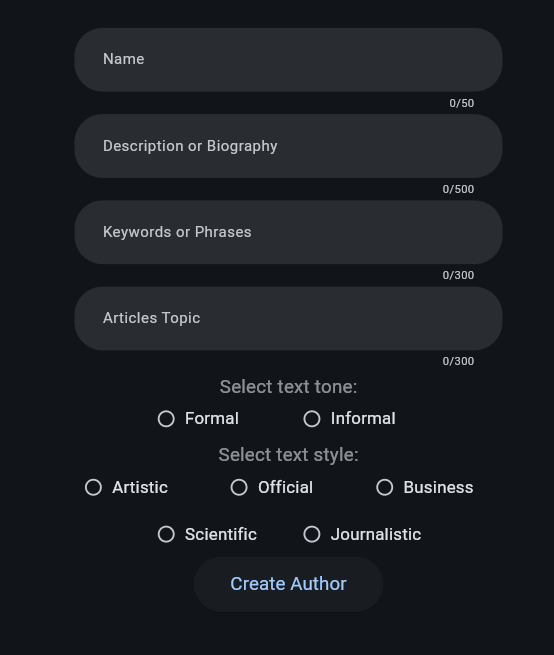
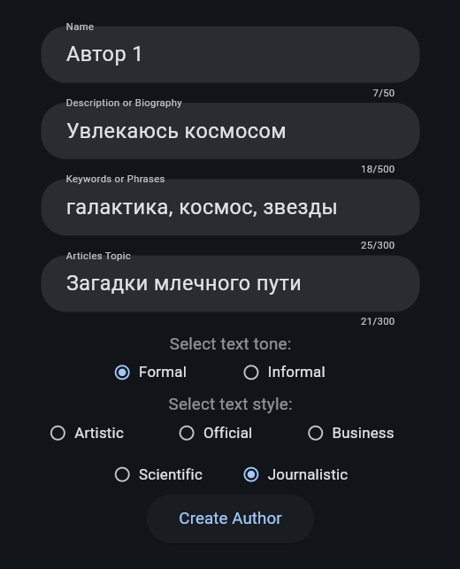
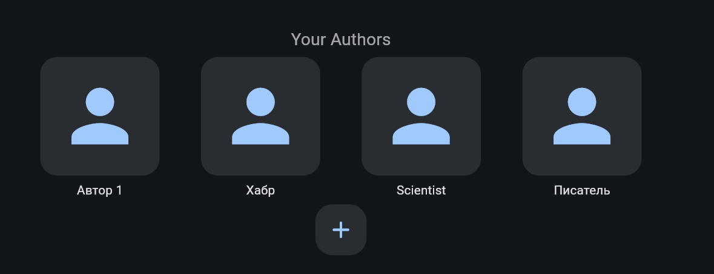
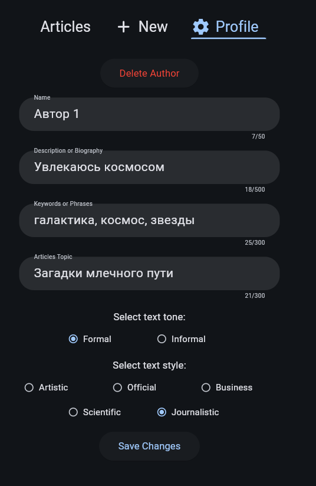
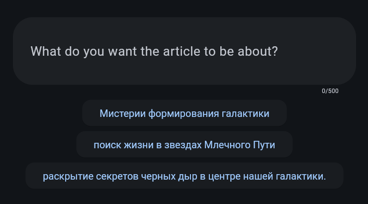
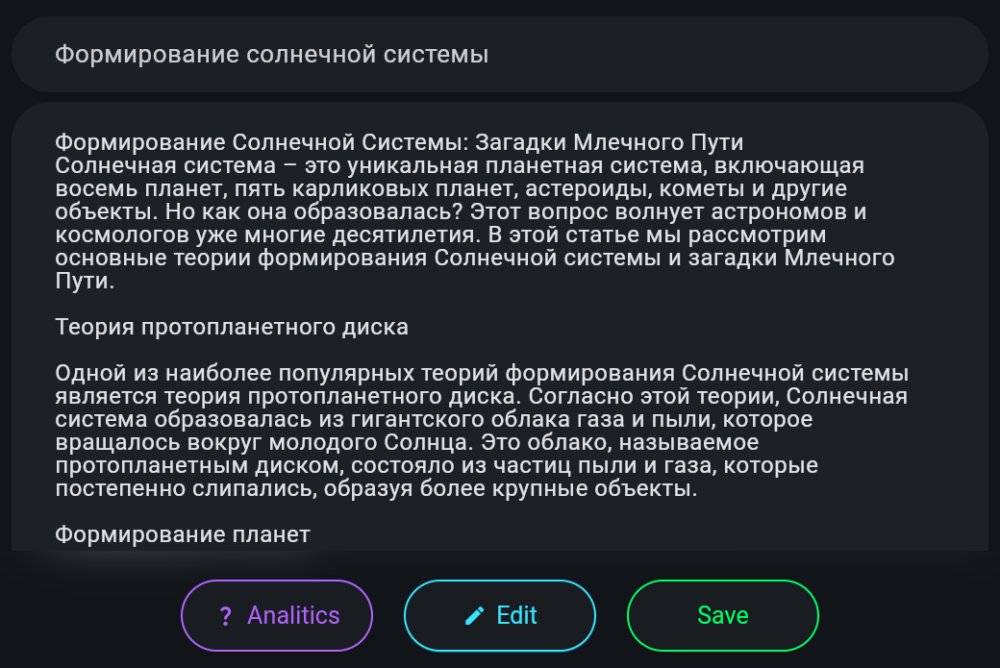
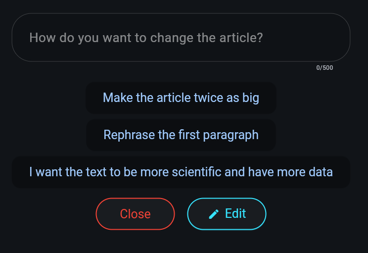
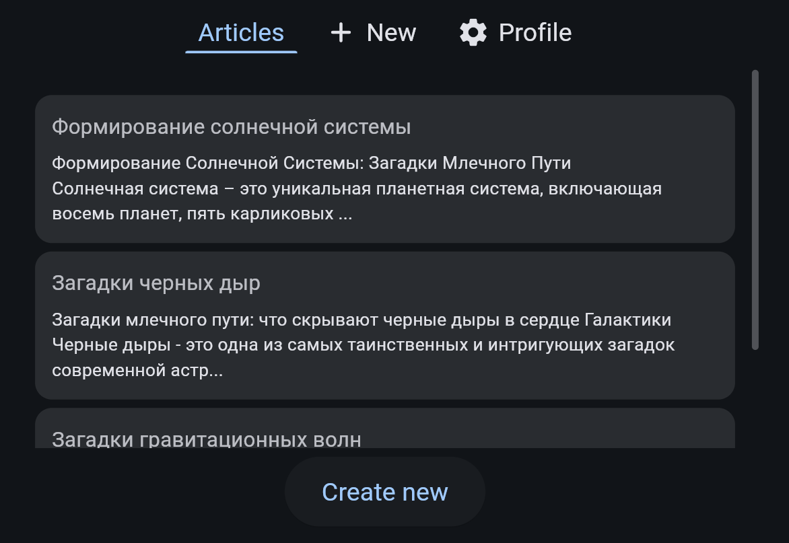

# ContentMaster
### Project for hackathon CODEMASTERS CODE CUP (Track "Development of business applications using artificial intelligence")










## Instructions for running project in dev mode

### Set up a virtual environment
#### Linux
```commandline
python3 -m venv venv
source venv/bin/activate
```
#### Windows
```commandline
python -m venv venv
venv/Scripts/activate
```

### Install dependencies
#### Linux
```commandline
pip3 install -r requirements.txt
```
#### Windows
```commandline
pip install -r requirements.txt
```

### Run the server
#### Desktop mode
```commandline
flet run
```
#### Web mode
```commandline
flet run --web --port 5000
```
#### Web mode with hot reload
(Server will restart every time any file in the project changes)
```commandline
pip install poetry
```
```commandline
poetry run flet run --web --port 5000 -d -r main.py
```
